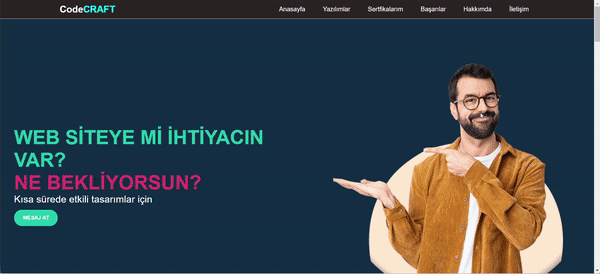

<h1>portfolio</h1>

Kişilleştirilmiş biyografik bir web sayfası örneği. Bu projede, google fonts kütüphanesi kullanıldı. Bootstrap ve  font-awesome kütüphanelerinden kyararlanıldı. Html kodları ile projenin iskeletini yapıp, css ile stil özellikleri verildi. Ayrıca her ekrana uygun olarak responsive edilmiştir.

<h2>Kullanılan Teknolojiler</h3>
 -HTML
 -CSS
 -JavaScript
 -Bootstrap

 <h3>Ekran Görüntüsü</h3>

 
 